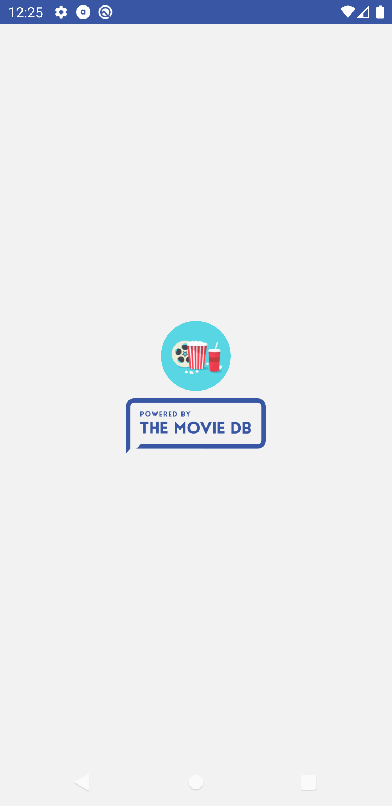
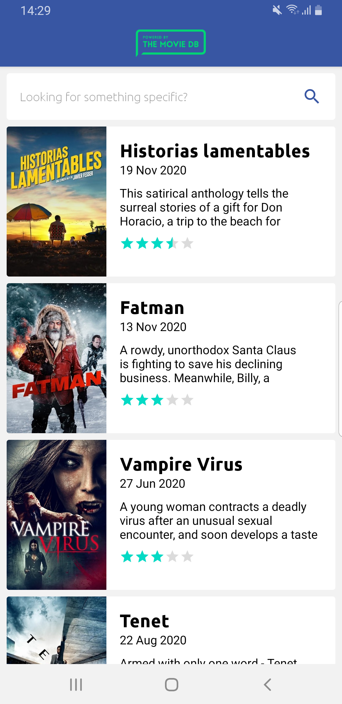
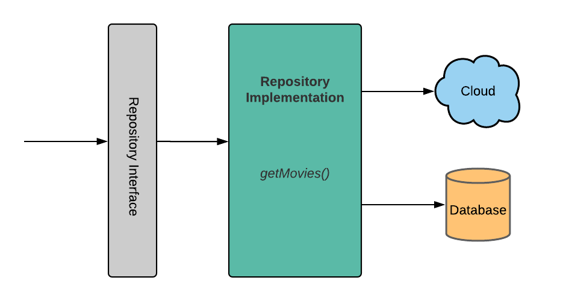

Movies (android mobile app)
=================

Movies app illustrating Android development best practices with Android Jetpack.

Getting Started
---------------

### Android Studio IDE setup
For development, the latest version of Android Studio is required.
The latest version can be downloaded from [here](https://developer.android.com/studio/).

This project uses the Gradle build system.
To build this project, use the `gradlew build` command or use `Build` command in Android Studio.

### Coding style
App uses [Square](https://github.com/square/java-code-styles) coding styles.
[Here's](https://github.com/square/java-code-styles/blob/main/README.md) how to configure it for use with Android Studio
(instructions adapted from Sqaure README)

Screenshots
-----------

Architecture
--------------
**Model窶天iew窶的ntent (MVI)** is one of the newest architecture patterns for Android, inspired by the unidirectional and cyclical nature of the  _Cycle.js_  framework.

MVI works in a very different way compared to its distant relatives, MVC, MVP or MVVM. The role of each MVI components is as follows:

-   _Model_  represents a state. Models in MVI should be immutable to ensure a unidirectional data flow between them and the other layers in your architecture.
-   Like in MVP, Interfaces in MVI represent  _Views_, which are then implemented in one or more Activities or Fragments.
-   _Intent_  represents an intention or a desire to perform an action, either by the user or the app itself. For every action, a View receives an Intent. The Presenter observes the Intent, and Models translate it into a new state.

**Repository modules** handle data operations. They provide a clean API so that the rest of the app can retrieve this data easily. They know where to get the data from and what API calls to make when data is updated. You can consider repositories to be mediators between different data sources, such as persistent models, web services, and caches.

Libraries
--------------
* [Retorift](https://github.com/square/retrofit) Used for API requests
* [Room](https://developer.android.com/topic/libraries/architecture/room) Used for database
* [Dagger 2](https://github.com/google/dagger) Used for dependency injection
* [Glide](https://github.com/bumptech/glide) Used for image loading
* [Navigation](https://developer.android.com/guide/navigation/navigation-getting-started) Handle everything needed for in-app navigation
* [ViewModel](https://www.google.com/aclk?sa=l&ai=DChcSEwjF_9mdi9rsAhWFGHsKHfBeCUMYABAAGgJsZQ&sig=AOD64_3JpFaMS2BFPlkU6waX4Jkw3UVD1g&q&adurl&ved=2ahUKEwil39Cdi9rsAhUK_CoKHaWPDa8Q0Qx6BAgwEAE) Store UI-related data that isn't destroyed on app rotations. Easily schedule asynchronous tasks for optimal execution